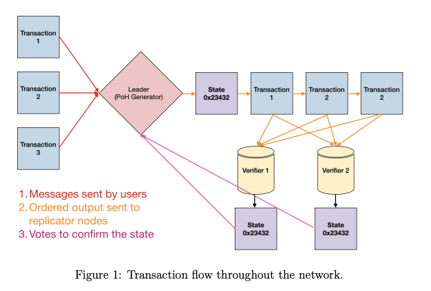
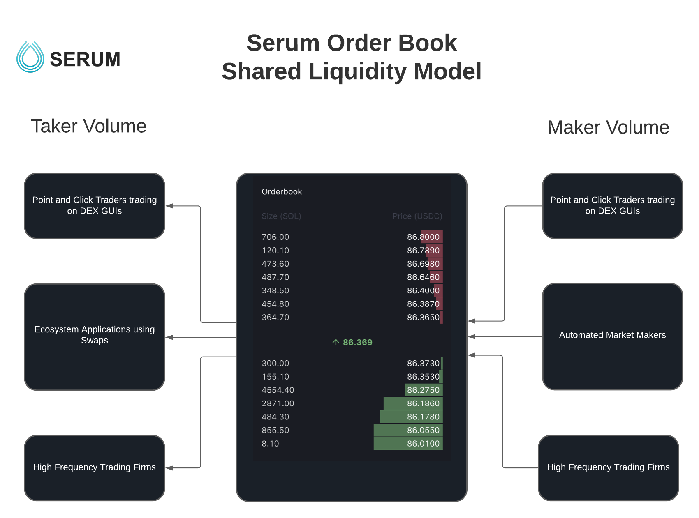
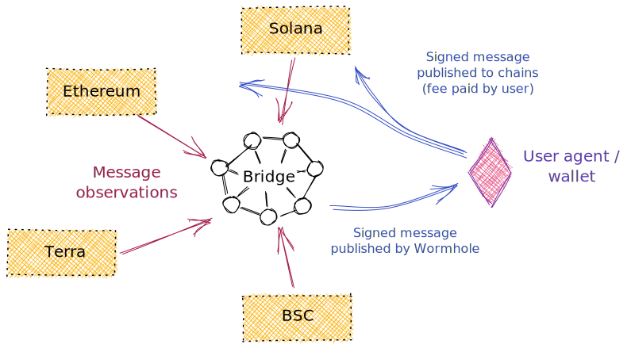

# Solana Network

> Solana 由 Anatoly Yakovenko ,Eric Williams 和技術總監Greg Fitzgerald于2017年共同發起,目標是解決比特幣和以太坊區塊鏈中存在的吞吐量問題.

> 免信任加入(trustless)

> Solana 原生代幣 SOL: 流通供應量為2,600萬枚,供應量上限則為4.89億枚SOL.

## Solana Consensus (PoH)

> Proof of History 歷史證明共識機制

> 其特點: Solana 具有200個分散在各地的 節點,采用GPU運算支持超過50,000TPS的交易吞吐量

> Solana 通過PoH方式,透過創建歷史記錄,證明交易在某一特定時間發生.PoH 采用稱爲(可延遲函數Verifiable Delay Function VDF)的加密算法.VDF 只能以特定數量的順序步驟運算得出,不容許并行處理,因此很容易定義這些步驟需要的時間,經運算交易,將被賦予獨一無二的雜凑值和可公開驗證的序列數,後者功能類似時間戳,可反應發生的時間.每個節點都設有其[加密時鐘],用以記錄和追蹤交易的時間順序,在此機制下,Solana網絡才能實現高吞吐量和高效運作.

#### Solana Network 具有8項核心創新

- PoH (無需節點通訊即可達成共識的時鐘)

> Solana的PoH共識算法，透過建立交易的歷史記錄，可以使系統更輕易地跟蹤交易的時間順序，有助使用者以Solana協議為基礎，創建更高效率、更高吞吐率的應用程式及交易所。

- BFT算法 → PBFT的PoH優化版本

> 塔式BFT是一種類似於PBFT（實用拜占庭容錯算法）的共識算法，旨在發揮同步時鐘的優勢。塔式BFT用PoH模式發揮其加密時鐘的作用，促進網絡達成共識，減省大量節點通訊和交易延遲的時間與成本

- 渦輪機（Turbine） → 區塊數據傳輸協議

> 透過將數據分成較細小的數據封包，渦輪機（Turbine）協議使區塊鏈節點間的數據傳輸變得更加容易。這使Solana可以解決頻寬限制的問題，並提高其整體容量，令交易可以更快地完成

- Gulf Stream :免Mempool的推送交易協議

> 灣流（Gulf Stream）協議在推動交易緩存、將其推送到網絡邊緣方面發揮重要作用。這使驗證者可以提前執行交易，從而減少交易確認時間，更快速的領導者（Leader）輪換，並減輕了未確認交易池的驗證者的緩存壓力，讓Solana每秒可處理50,000宗交易

- Sealevel 智能合約運作並行引擎\

> 海平面（Sealevel）是一個高度並行化的交易處理引擎，它可以使Solana的執行時間更有效率，還可讓交易在相同狀態的區塊鏈上同時執行。

- Pipeline :用於優化驗證功能的交易處理模塊

> Pipelining是指輸入的數據流會被分配給負責處理數據的不同硬件。此交易處理模塊可讓交易訊息可以快速被驗證和在網絡中所有節點之間傳播。

- Cloudbreak 橫向擴展的賬戶數據庫

> 雲儲存（Cloudbreak）的數據結構，適合整個網絡的同時並行資料讀寫，是Solana網絡達到可快速擴充特質的關鍵

- Archivers : 分佈式賬本儲存

> Solana網絡上的數據會從驗證者（validators）轉移到稱為「存檔器（Archivers）」的節點網絡。這些節點可以是例如手提電腦等輕量設備，並且會經常作系統檢查，以確保這些節點儲存的數據正確

##  Solana（SOL）Cluster

> Cluster（群集）是一組可以一起工作運算的電腦，可視為單一系統。每個Solana Cluster都是一組通常相互協作（也可以相互對抗）的、獨立自營的電腦，可幫助驗證不可信賴、由用戶提交的應用程式輸出。此外，用戶可以透過使用Solana Cluster，去保存事件或交易的永久記錄。

Solana Cluster的應用例子包括，追蹤哪些電腦可以正常運作，追蹤其擁有的實體資產。 只要有人擁有該應用程式賬本的副本，該應用程式的輸出將始終能夠被複製，並且獨立於發行該賬本的組織或機構

#### Solana 運行過程

- 向領導者（Leader）輸入交易
- 領導者將對交易進行排序並對作有效整理，以便其他節點可以處理
- 領導者按儲存在RAM的當前狀態執行交易 
- 領導者將交易，連同最終狀態的簽名，發佈給校驗者（複製節點）
- 校驗者（Verifiers）在其狀態副本上執行相同的交易，並在確認後發布其狀態簽名
- 已發布的確認將作為共識算法的投票

## Serum 

> The Serum ecosystem is a diverse collection of innovative decentralised applications building upon the Serum order book and matching engine architecture.

Serum 生态系统是基于 Serum 订单簿和匹配引擎架构的创新去中心化应用程序的多样化集合。

#### Serum Order Book Shared Liquidity Model

> Maker Volume

- Point & Click Traders trading on DEX GUIs

- Automated Market Makers

- High Frequency Trading Firms(高频交易)

> Taker Volume

- Point & Click Traders trading on DEX GUIs

- Ecosystem Applications using Swaps

- High Frequency Trading Firms

#### Serum Trading GUIs

> Anyone can set up their own state-of-the-art Serum-based DEX GUI or embed the Serum Swapper into their UI.
Each trading interface that interacts with Serum is free to customize their user experience and restrictions to comply with the regulations of their target market.

## Wormhole V2

