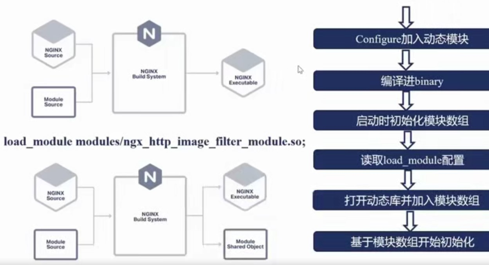

# Nginx 

> ginx.org/en/linux_packages.html

## Commands

```bash
nginx -s quit				#
nginx -c /etc/nginx/nginx.conf  #
nginx -t
nginx -V 			# 查看当前已安装模块

#
 2>&1 nginx -V | tr ' '  '\n'|grep image   # 查看当前已安装模块


```

## 动态引入新模块



- Configure加入动态模块：只有部分模块可以以动态模块的身份编译
- 执行make，编译出 binary
- 启动时会去读 ngx_modules[] 数组，在模块数组中会发现使用了某个动态模块
- 在nginx.conf中需要加入一个配置项 load_modules，这个配置项指明了这个动态模块所在的路径
- 接下来就可以在Nginx进程中打开动态库并上面的模块加入模块数组中。
- 基于模块数组再进行初始化过程。

> 查看可以增加哪些动态模

```bash
./configure --help | more					# 后面带有 dynamic 关键字的即为可以动态模块身份编译的

```


#### 添加 --with-http-image_filter_module=dynamic 动态模块

```bash
sudo -i 
cd /opt
# 查看当前Nginx配置 及版本
2>&1 nginx -V | tr ' '  '\n'			# Or  2>&1 nginx -V | tr ' '  '\n' |grep imgage
 
 
# download source code 要与当前版本对应
wget http://nginx.org/download/nginx-1.20.1.tar.gz
tar -zxvf nginx-1.20.1.tar.gz
cd nginx-1.20.1

# 查看支持的 module
./configure --help | grep dynamic 
./configure --prefix=/home/geek/nginx_tmp/ --with http_image_filter_module=dynamic


```


## Nginx 反向代理


#### Nginx 反向代理nodejs 配置


#### Issues

> ./configure: error: the HTTP rewrite module requires the PCRE library.

```bash
yum -y install pcre-devel openssl openssl-devel
```

### Vim

- 注释多行
1、首先，将光标放在要注释的行首，然后按ESC进入命令行模式;
2、按Ctrl + V进入 VISUAL BLOCK ；
3、按 PgUp/PgDn选择要注释的行；
4、按大写的i进入插入模式；
5、输入#,按ESC保存即可

- 删除多行
1、首先，将光标放在注释的行首，然后按ESC进入命令模式；
2、按Ctrl + V进入 VISUAL BLOCK；
3、按PgUp选择要删除的注释行；
4、按X即可删除第一列#；
5、如果有多个"#",重复上述步骤

### Docker Nginx

!/bin/bash
NGINX_DIR=`pwd`
docker stop nginx
docker rm nginx
docker run -d --restart always -p 80:80 --name nginx --privileged=true -v /opt/nft-service:/data/java -v ${NGINX_DIR}/conf/nginx.conf:/etc/nginx/nginx.conf:ro -v ${NGINX_DIR}/conf.d:/etc/nginx/conf.d -v ${NGINX_DIR}/logs:/etc/nginx/logs nginx
