# Javascript & WebAssembly


## 什么是 WebAssembly

> WebAssembly 是除了 JavaScript 以外，另一种可以在浏览器中执行的编程语言。所以当人们说 WebAssembly 更快的时候，一般来讲是与 JavaScript 相比而言的

>  2008 年打响了性能大战。许多浏览器引入了 Just-in-time 编译器，也叫 JIT。基于 JIT 的模式，JavaScript 代码的运行渐渐变快。


**正是由于这些 JIT 的引入**，使得 JavaScript 的性能达到了一个转折点，JS 代码执行速度快了 10 倍。

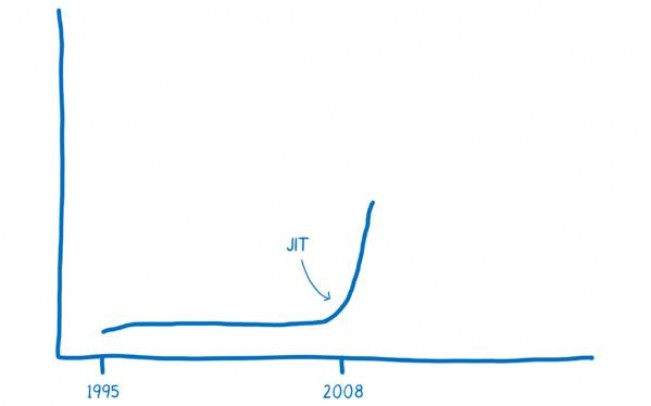

随着性能的提升，JavaScript 可以应用到以前根本没有想到过的领域，比如用于后端开发的 Node.js。性能的提升使得 JavaScript 的应用范围得到很大的扩展。

现在通过 WebAssembly，我们很有可能正处于第二个拐点。

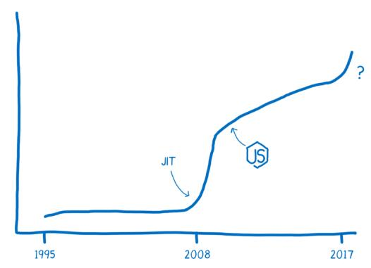


## JavaScript Just-in-time (JIT) 工作原理


### JavaScript 在浏览器中是如何运行的?

> 如果是你一个开发者，当你决定在你的页面中使用 JavaScript 的时候，有两个要考虑的事情：目标和问题。

  - 目标：告诉计算机你想做什么。
  - 问题：你和计算机说不同的语言，无法沟通。

你说的是人类的语言，而计算机用的是机器语言。机器语言也是一种语言，只是 JavaScript 或者其他高级编程语言机器能看得懂，而人类不用他们来交流罢了。它们是基于人类认知而设计出来的。

所以呢，JavaScript 引擎的工作就是把人类的语言转换成机器能看懂的语言。

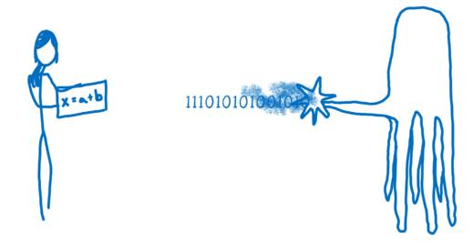

在电影里面，人类和外星人不仅仅是语言不同，两个群体看待世界的方式都是不一样的。其实人类和机器也是类似(后面我会详细介绍)。

那么，翻译是如何进行的呢?

在代码的世界中，通常有两种方式来翻译机器语言：解释器和编译器。

如果是通过解释器，翻译是一行行地边解释边执行

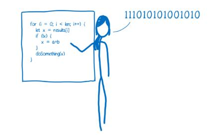

编译器是把源代码整个编译成目标代码，执行时不再需要编译器，直接在支持目标代码的平台上运行

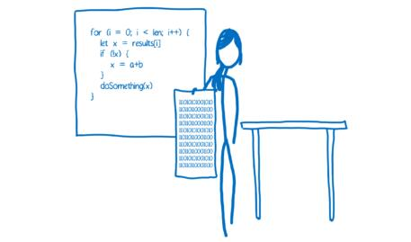

### 解释器的利弊

解释器启动和执行的更快。你不需要等待整个编译过程完成就可以运行你的代码。从第一行开始翻译，就可以依次继续执行了。

正是因为这个原因，解释器看起来更加适合 JavaScript。对于一个 Web 开发人员来讲，能够快速执行代码并看到结果是非常重要的。

这就是为什么最开始的浏览器都是用 JavaScript 解释器的原因。

可是当你运行同样的代码一次以上的时候，解释器的弊处就显现出来了。比如你执行一个循环，那解释器就不得不一次又一次的进行翻译，这是一种效率低下的表现

### 编译器的利弊

编译器的问题则恰好相反。

它需要花一些时间对整个源代码进行编译，然后生成目标文件才能在机器上执行。对于有循环的代码执行的很快，因为它不需要重复的去翻译每一次循环。

另外一个不同是，编译器可以用更多的时间对代码进行优化，以使的代码执行的更快。而解释器是在 runtime 时进行这一步骤的，这就决定了它不可能在翻译的时候用很多时间进行优化。

###  Just-in-time 编译器：综合了两者的优点

为了解决解释器的低效问题，后来的浏览器把编译器也引入进来，形成混合模式。

不同的浏览器实现这一功能的方式不同，不过其基本思想是一致的。在 JavaScript 引擎中增加一个监视器(也叫分析器)。监视器监控着代码的运行情况，记录代码一共运行了多少次、如何运行的等信息。

起初，监视器监视着所有通过解释器的代码。

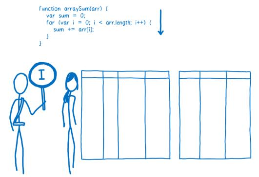

如果同一行代码运行了几次，这个代码段就被标记成了 “warm”，如果运行了很多次，则被标记成 “hot”

### 基线编译器

如果一段代码变成了 “warm”，那么 JIT 就把它送到编译器去编译，并且把编译结果存储起来。

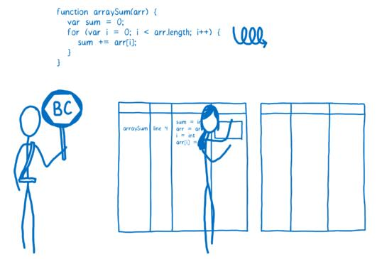

代码段的每一行都会被编译成一个“桩”(stub)，同时给这个桩分配一个以“行号 + 变量类型”的索引。如果监视器监视到了执行同样的代码和同样的变量类型，那么就直接把这个已编译的版本 push 出来给浏览器。

通过这样的做法可以加快执行速度，但是正如前面我所说的，编译器还可以找到更有效地执行代码的方法，也就是做优化。

基线编译器可以做一部分这样的优化(下面我会给出例子)，不过基线编译器优化的时间不能太久，因为会使得程序的执行在这里 hold 住。

不过如果代码确实非常 “hot”(也就是说几乎所有的执行时间都耗费在这里)，那么花点时间做优化也是值得的。

### 优化编译器

如果一个代码段变得 “very hot”，监视器会把它发送到优化编译器中。生成一个更快速和高效的代码版本出来，并且存储之。

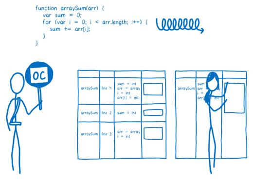

为了生成一个更快速的代码版本，优化编译器必须做一些假设。例如，它会假设由同一个构造函数生成的实例都有相同的形状——就是说所有的实例都有相同的属性名，并且都以同样的顺序初始化，那么就可以针对这一模式进行优化。

整个优化器起作用的链条是这样的，监视器从他所监视代码的执行情况做出自己的判断，接下来把它所整理的信息传递给优化器进行优化。如果某个循环中先前每次迭代的对象都有相同的形状，那么就可以认为它以后迭代的对象的形状都是相同的。可是对于 JavaScript 从来就没有保证这么一说，前 99 个对象保持着形状，可能第 100 个就少了某个属性。

正是由于这样的情况，所以编译代码需要在运行之前检查其假设是不是合理的。如果合理，那么优化的编译代码会运行，如果不合理，那么 JIT 会认为做了一个错误的假设，并且把优化代码丢掉。

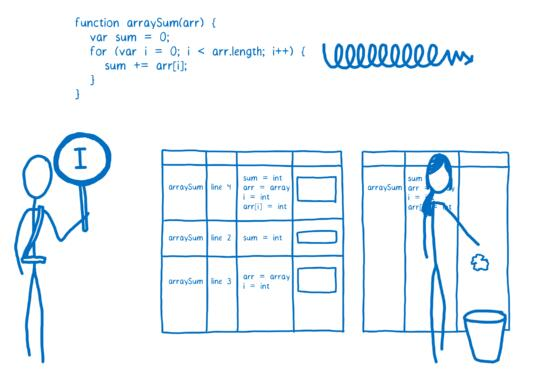

这时(发生优化代码丢弃的情况)执行过程将会回到解释器或者基线编译器，这一过程叫做去优化。

通常优化编译器会使得代码变得更快，但是一些情况也会引起一些意想不到的性能问题。如果你的代码一直陷入优化<->去优化的怪圈，那么程序执行将会变慢，还不如基线编译器快。

大多数的浏览器都做了限制，当优化/去优化循环发生的时候会尝试跳出这种循环。比如，如果 JIT 做了 10 次以上的优化并且又丢弃的操作，那么就不继续尝试去优化这段代码了桩。


#### 一个优化的例子：类型特化(Type specialization)

> 有很多不同类型的优化方法，这里我介绍一种，让大家能够明白是如何优化的。优化编译器最成功一个特点叫做类型特化，下面详细解释。

JavaScript 所使用的动态类型体系在运行时需要进行额外的解释工作，例如下面代码：

```javascript
function arraySum(arr) {
  var sum = 0;
  for (var i = 0; i < arr.length; i++) {
    sum += arr[i];
  }
}
```

+= 循环中这一步看起来很简单，只需要进行一步计算，但是恰恰因为是用动态类型，他所需要的步骤要比你所想象的更复杂一些。

我们假设 arr 是一个有 100 个整数的数组。当代码被标记为 “warm” 时，基线编译器就为函数中的每一个操作生成一个桩。sum += arr[i]会有一个相应的桩，并且把里面的 += 操作当成整数加法。

但是，sum 和 arr[i] 两个数并不保证都是整数。因为在 JavaScript 中类型都是动态类型，在接下来的循环当中，arr[i] 很有可能变成了string 类型。整数加法和字符串连接是完全不同的两个操作，会被编译成不同的机器码。

JIT 处理这个问题的方法是编译多基线桩。如果一个代码段是单一形态的(即总是以同一类型被调用)，则只生成一个桩。如果是多形态的(即调用的过程中，类型不断变化)，则会为操作所调用的每一个类型组合生成一个桩。

这就是说 JIT 在选择一个桩之前，会进行多分枝选择，类似于决策树，问自己很多问题才会确定最终选择哪个，见下图:

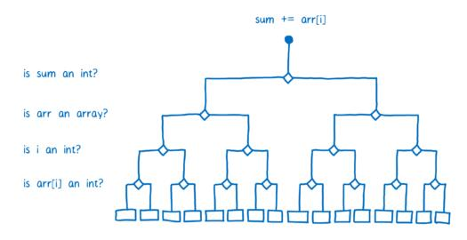

正是因为在基线编译器中每行代码都有自己的桩，所以 JIT 在每行代码被执行的时候都会检查数据类型。在循环的每次迭代，JIT 也都会重复一次分枝选择。

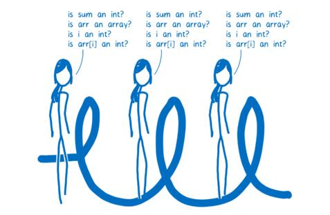

如果代码在执行的过程中，JIT 不是每次都重复检查的话，那么执行的还会更快一些，而这就是优化编译器所需要做的工作之一了。

优化编译器中，整个函数被统一编译，这样的话就可以在循环开始执行之前进行类型检查。

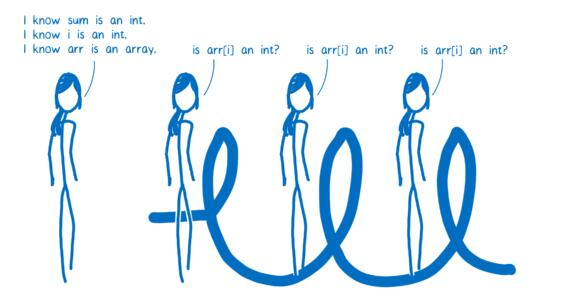

一些浏览器的 JIT 优化更加复杂。比如在 Firefox 中，给一些数组设定了特定的类型，比如里面只包含整型。如果 arr 是这种数组类型，那么 JIT 就不需要检查 arr[i] 是不是整型了，这也意味着 JIT 可以在进入循环之前进行所有的类型检查。

### 总结

> 简而言之 JIT 是什么呢?它是使 JavaScript 运行更快的一种手段，通过监视代码的运行状态，把 hot 代码(重复执行多次的代码)进行优化。通过这种方式，可以使 JavaScript 应用的性能提升很多倍。

为了使执行速度变快，JIT 会增加很多多余的开销，这些开销包括：

  - 优化和去优化开销
  - 监视器记录信息对内存的开销
  - 发生去优化情况时恢复信息的记录对内存的开销
  - 对基线版本和优化后版本记录的内存开销
  
这里还有很大的提升空间：即消除开销。通过消除开销使得性能上有进一步地提升，这也是 WebAssembly 所要做的事之一。

## 编译器如何生成汇编

> 理解什么是汇编，以及编译器如何生成它，对于理解 WebAssembly 是很有帮助的。

现在来思考一下“外星人”的大脑是如何工作的——机器的“大脑”是如何对我们输入给它的内容进行分析和理解的。“大脑”中，有一部分负责思考——处理加法、减法或者逻辑运算。还有其他的部分分别负责短暂记忆和长期记忆的。

**这些不同的部分都有自己的名字：**

  - 负责思考的部分叫做算数逻辑单元(ALU)
  - 寄存器提供短暂记忆功能
  - 随机存取存储器(RAM)提供长期记忆功能

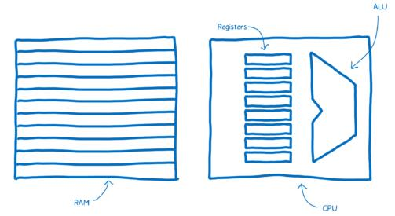

机器代码中的语句称作指令。

那么在指令进入“大脑”以后都发生了什么呢?它们会被切分为不同的部分传送到不同的单元进行处理。

“大脑”切分指令通过不同连接线路进行。举个例子，“大脑”会将指令最开始的 6 比特通过管道送到 ALU 中。而 ALU 会通过 0 和 1 的位置来决定对两个数做加法。

这串 01 串就叫做“操作码”，它告诉了 ALU 要执行什么样的操作。

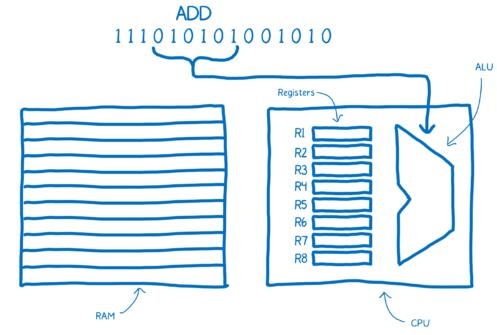

然后“大脑”会取后面两个连续的 3 比特 01 串来确定把哪两个数加到一起，而这 3 比特指的是寄存器的地址。

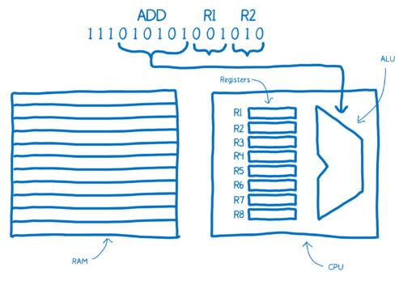

注意看上面机器码的注释：“ADD R1 R2”，这对于人类来讲很容易理解其含义。这就是汇编，也叫符号机器码，它使人类也能看懂机器代码的含义。

可以看到汇编和这台机器的机器码之间有直接的映射关系。正是因为如此，拥有不同机器结构的计算机会有不同的汇编系统。如果你有一个机器，它有自己的内部结构，那么它就需要它所独有的汇编语言。

从上面的分析可以知道我们进行机器码的翻译并不是只有一种，不同的机器有不同的机器码，就像我们人类也说各种各样的语言一样，机器也“说”不同的语言。

人类和外星人之间的语言翻译，可能会从英语、德语或中文翻译到外星语 A 或者外星语 B。而在程序的世界里，则是从 C、C++ 或者 JAVA 翻译到 x86 或者 ARM。

你想要从任意一个高级语言翻译到众多汇编语言中的一种(依赖机器内部结构)，其中一种方式是创建不同的翻译器来完成各种高级语言到汇编的映射。


这种翻译的效率实在太低了。为了解决这个问题，大多数编译器都会在中间多加一层。它会把高级语言翻译到一个低层，而这个低层又没有低到机器码这个层级。这就是中间代码( intermediate representation，IR)

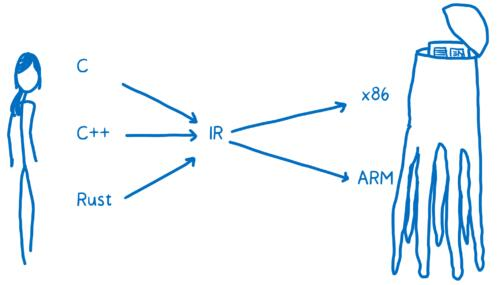

这就是说编译器会把高级语言翻译到 IR 语言，而编译器另外的部分再把 IR 语言编译成特定目标结构的可执行代码。

重新总结一下：编译器的前端把高级语言翻译到 IR，编译器的后端把 IR 翻译成目标机器的汇编代码。

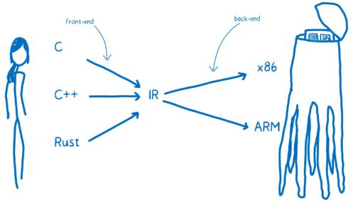